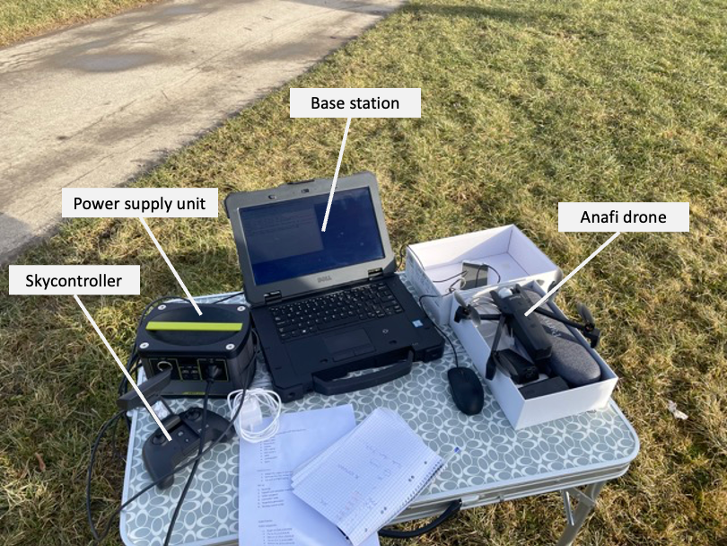

# Integrated Multi-Simulation Environments for Aerial Robotics Research

Welcome to the repository providing the code used for the paper 

**Integrated Multi-Simulation Environments for Aerial Robotics Research**

by Pascal Goldschmid and Aamir Ahmad

The paper can be found [here](https://arxiv.org/abs/2502.10218).

Experimental data (log files, videos of real world flights, etc.) can be found here.

If you have any questions, comments or suggestions please contact pascal.goldschmid@ifr.uni-stuttgart.de


---


## Using the framework for real world experiments
### Setup
In order to conduct real world experiments you need to prepare the following setup.
1. A base station (e.g. a laptop) with ROS installed and the catkin workspace of this project.
2. The skycontroller needs to be connected using a USB3 cable with your base station running your ROS code.
3. An Anafi drone.



### Deploying the system
#### Preliminaries
The origin of the world is set to the position where the drone is located at the moment when it is turned on.
On the base station, open six terminal windows and navigate to the catkin workspace of this project.
Don't forget to checkout the branch *real_flights*. Source the catkin workspace using 
```
source ~/sphinx_with_gazebo_code/sphinx_with_gazebo/other_files/setup.bash
```

#### First terminal window: Anafi ROS bridge
In the first terminal window, execute the command
```
cd ~/sphinx_with_gazebo_code/sphinx_gazebo_ws
source ~/sphinx_with_gazebo_code/sphinx_with_gazebo/other_files/setup.bash
./src/anafi_control/launch/launch_anafi_ros_interface.sh
```
This will launch the [anafi_ros](https://github.com/andriyukr/anafi_ros/tree/ros1) package and create an interface to the Anafi drone via ROS.

#### Second terminal window: Sending high-level commands
This terminal window is used to send high-level commands to the drone, such as take off or receiving commands from ROS instead of the Skycontroller.
In order to send the take off command to the drone, run
```
cd ~/sphinx_with_gazebo_code/sphinx_gazebo_ws
source ~/sphinx_with_gazebo_code/sphinx_with_gazebo/other_files/setup.bash
rosservice call /anafi/drone/takeoff
```
In order to have the Anafi drone receive commands not from the Skycontroller but from ROS instead, run
```
cd ~/sphinx_with_gazebo_code/sphinx_gazebo_ws
source ~/sphinx_with_gazebo_code/sphinx_with_gazebo/other_files/setup.bash
rosservice call /anafi/skycontroller/offboard "data: true" 
```
To switch back to manual control, run 
```
cd ~/sphinx_with_gazebo_code/sphinx_gazebo_ws
source ~/sphinx_with_gazebo_code/sphinx_with_gazebo/other_files/setup.bash
rosservice call /anafi/skycontroller/offboard "data: false" 
```
#### Third terminal window: Sending waypoint commands
In order to send waypoint commands to the drone, run 
```
cd ~/sphinx_with_gazebo_code/sphinx_gazebo_ws
source ~/sphinx_with_gazebo_code/sphinx_with_gazebo/other_files/setup.bash
rostopic pub /anafi/position_control/waypoint anafi_control/Waypoint "{x: 0.0, y: 0.0, z: 1.0, v_x: 0.0, v_y: 0.0, v_z: 0.0, yaw: 0.0}" -r10
```
This publishes a waypoint with a frequency of 10hz. The waypoint will make the drone hover in altitude of 1m over the point where the drone was turned on.

#### Forth terminal window: Launching a tracking controller
##### Launching the PID-based controller framework
To launch the PID-based controller framework, run
```
cd ~/sphinx_with_gazebo_code/sphinx_gazebo_ws
source ~/sphinx_with_gazebo_code/sphinx_with_gazebo/other_files/setup.bash
roslaunch anafi_control anafi_controll_all_cascaded_pid_controllers.launch
```
In this framework, four control loops are created that independently control the drone's motion in longitudinal, lateral, and vertical direction as well as its heading, i.e. the yaw angle.
All control loops are in a single-input-single-output configuration where the control loops associated with the longitudinal and lateral direction have a cascaded structure with two cascades. 
##### Launching the model predictive controller framework

To launch the MPC framework, run
```
cd ~/sphinx_with_gazebo_code/sphinx_gazebo_ws
source ~/sphinx_with_gazebo_code/sphinx_with_gazebo/other_files/setup.bash
roslaunch anafi_control anafi_control_waypoint_mpc.launch
```
This launches a MPC to control calculating optimal solutions for the motion in lontitudinal, lateral and vertical direction. The motion around the vertical axis, i.e. the heading and therefore the yaw angle is controlled by the same PID-based control loop than in the PID-based controller framework.


#### Fifth terminal window: Generating trajectories
The [trajectory_generator_node](sphinx_gazebo_ws/src/anafi_control/scripts/trajectory_generator.py) can be used to send waypoints following predefined trajectories. The following trajectories are available:
1. Static waypoints
2. Circular trajectories
3. Rectilinear periodic movements
The trajectories can be set for each direction of motion independently. To specifiy the parameters of a trajectory type for one specific direction of motion, change the following values accordingly given in the init function of the TrajectoryGenerator class defined in the [trajectory_generator_node](sphinx_gazebo_ws/src/anafi_control/scripts/trajectory_generator.py).
```
self.r_x = 0
self.r_y = 0
self.r_z = 1
self.v_x = 0
self.v_y = 0
self.v_z = 0
```
These values define the radii and velocities of the circular and rectilinear periodic trajectories.
When started, the trajectory generator publishes a static waypoint. To activate a moving waypoint, run e.g. the following command.
```
rostopic pub /trajectory_generator/trajectory_type_modifer std_msgs/String "data: 'circle_xy_z:rectilinear_z'"
```
This activates a circular trajectory in the xy-plane with a simultaeous rectilinear motion in the vertical direction. For other trajectory types, please check the code of the [trajectory_generator_node](sphinx_gazebo_ws/src/anafi_control/scripts/trajectory_generator.py).

#### Sixth terminal window: Logging data
During the real world experiments, it is advisable to log data using rosbag files. For this purpose, you can use the file [record_rosbag.bash](/experiments_evaluation/record_rosbag.bash) as follows
```
cd ~/sphinx_with_gazebo_code/experiment_evaluation
bash record_rosbag.bash YOUR_ROSBAG_FILE_NAME
```
This will create a rosbag file that logs all topics. The timestamp at the beginning of the logging will be attached to your specified file name.
Once the rosbag file is created, you can play it using ``` rosbag play PATH/TO/YOUR/ROSBAG/FILE``` and run the logging node anafi_control_logger.py (see other branch) to create .csv files with the waypoint and drone data.

##### Disclaimer
THIS SOFTWARE IS PROVIDED BY THE COPYRIGHT HOLDERS AND CONTRIBUTORS "AS IS"
AND ANY EXPRESS OR IMPLIED WARRANTIES, INCLUDING, BUT NOT LIMITED TO, THE
IMPLIED WARRANTIES OF MERCHANTABILITY AND FITNESS FOR A PARTICULAR PURPOSE ARE
DISCLAIMED. IN NO EVENT SHALL THE COPYRIGHT HOLDER OR CONTRIBUTORS BE LIABLE
FOR ANY DIRECT, INDIRECT, INCIDENTAL, SPECIAL, EXEMPLARY, OR CONSEQUENTIAL
DAMAGES (INCLUDING, BUT NOT LIMITED TO, PROCUREMENT OF SUBSTITUTE GOODS OR
SERVICES; LOSS OF USE, DATA, OR PROFITS; OR BUSINESS INTERRUPTION) HOWEVER
CAUSED AND ON ANY THEORY OF LIABILITY, WHETHER IN CONTRACT, STRICT LIABILITY,
OR TORT (INCLUDING NEGLIGENCE OR OTHERWISE) ARISING IN ANY WAY OUT OF THE USE
OF THIS SOFTWARE, EVEN IF ADVISED OF THE POSSIBILITY OF SUCH DAMAGE.
